# 🚀 Local LLM Test Case Generator

> **Built with the B.L.A.S.T. Protocol & A.N.T. Architecture**

A deterministic, self-healing tool that uses your **local Ollama instance** to generate structured software test cases from simple user stories or code snippets. No data leaves your machine.

---

## 🧠 Architecture Data Flow

The system follows the **A.N.T.** (Adapter, Nexus, Template) 3-Layer Architecture to ensure reliability over speed.

```mermaid
sequenceDiagram
    participant User
    participant T as 🎨 Template (Streamlit UI)
    participant N as 🧠 Nexus (Logic & Validation)
    participant A as 🔌 Adapter (Ollama Client)
    participant LLM as 🦙 Local Llama 3.2

    User->>T: Enters Requirement
    T->>N: Request Generation
    N->>A: Send System Prompt + Input
    A->>LLM: Streaming Request
    LLM-->>A: Raw Text Response
    A-->>N: Return Raw Content
    
    rect rgb(20, 20, 30)
        Note over N: 🛡️ Nexus Guardrails
        N->>N: Strip Markdown
        N->>N: Parse JSON
        N->>N: Validate w/ Pydantic Schema
        Note over N: If Invalid -> Trigger Retry (Self-Healing)
    end
    
    N-->>T: Validated Test Case Functions
    T-->>User: Render Premium Cards
```



---

## 🛠️ Technology Stack

-   **Core**: Python 3.13+
-   **AI Engine**: [Ollama](https://ollama.com/) (running `llama3.2`)
-   **Interface**: Streamlit (Premium Custom Theme)
-   **Validation**: Pydantic (Strict JSON Schema)

---

## ⚡ Quick Start

### 1. Prerequisites
-   Install **Ollama**: [Download Here](https://ollama.com)
-   Pull the model:
    ```bash
    ollama pull llama3.2
    ```

### 2. Installation
```bash
# Clone the repo
git clone https://github.com/sandeepgupta220427/AI-Tester-Blueprint-Projects.git
cd AI-Tester-Blueprint-Projects

# Create Virtual Environment
python3 -m venv .venv
source .venv/bin/activate

# Install Dependencies
pip install ollama streamlit pydantic
```

### 3. Run
```bash
streamlit run app_v1.py
```

---

## 📂 Project Structure

```text
.
├── app_v1.py                # 🎨 Template (The UI Layer)
├── tools/
│   ├── generator_logic.py   # 🧠 Nexus (The Brain/Validator)
│   └── ollama_client.py     # 🔌 Adapter (The Connector)
├── architecture/            # 🏛️ SOPs and Logic Rules
├── gemini.md                # 📜 Project Constitution & Schema
└── Blast.md                 # 🚀 Master Protocol
```

---

**License**: MIT
